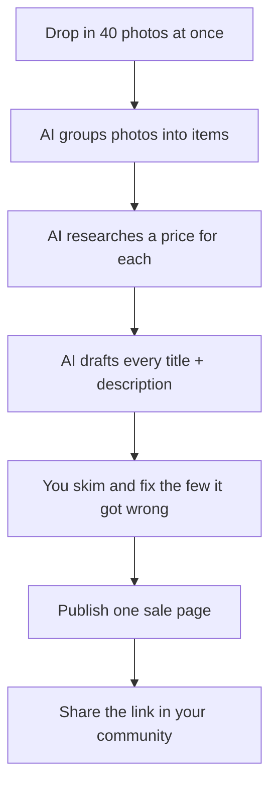
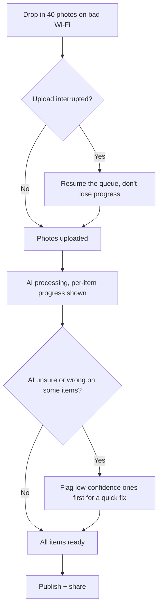
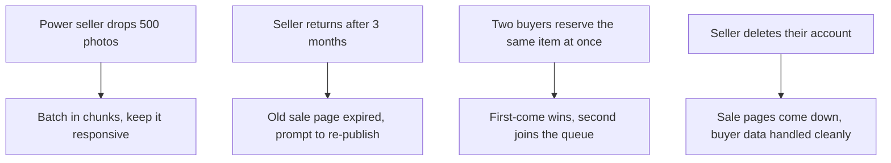
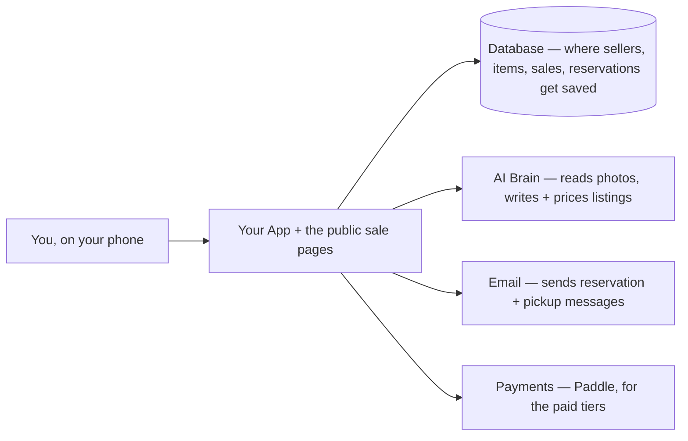
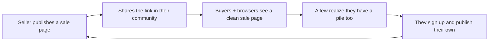
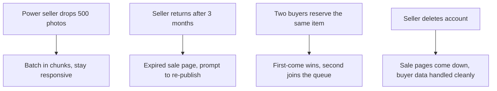
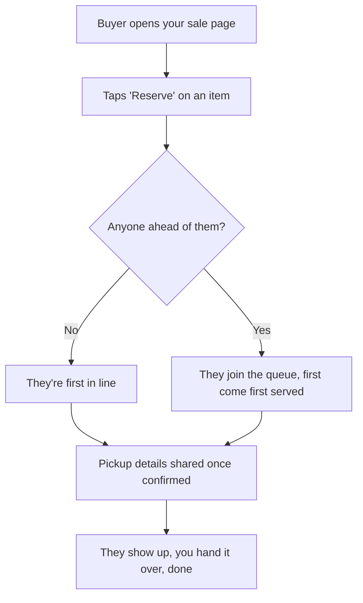
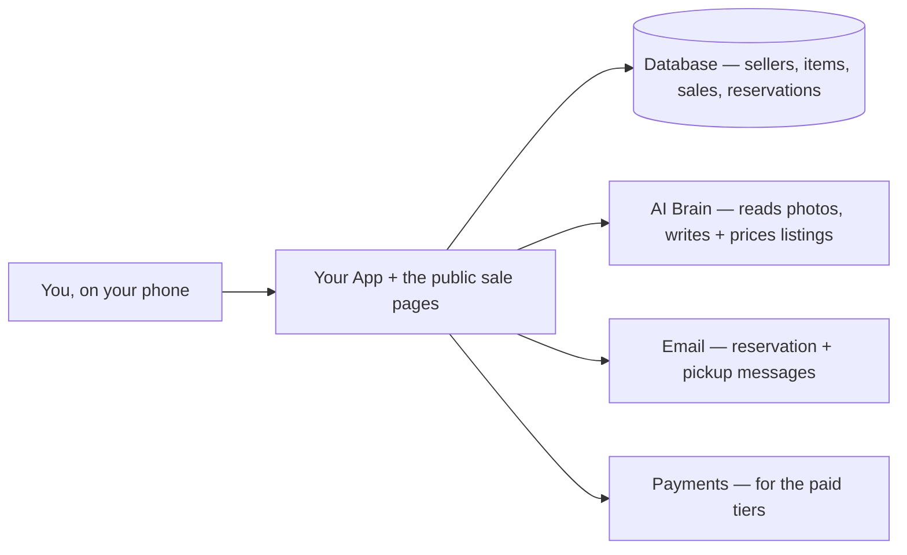

*This is a full vibe-check session on the ClearList idea, start to finish — the flagship example that walks every beat of the skill. Claude asks the questions, I answer, and it ends with the plan it generated plus a visual blueprint. The reality-check pulls from real seller complaints on r/declutter. This is what running the skill actually feels like, nothing skipped.*

---

# vibe-check — A Full Session (ClearList)

## Before anything: version, mode, and reading the room

**Claude:** Quick version note before we dive in — I'm running **vibe-check v1.7.2**. *(Behind the scenes I do a quick best-effort check of the latest version; if a newer one were out I'd mention it once, kindly, then carry on. Yours is current, so onward.)*

You've got an idea you haven't built yet, so we're in **Planning Mode** — we'll walk it from a fuzzy idea to a plan you can hand to your AI coding tool. (If you'd already built a tangled app and were scared to touch it, I'd switch to Checkup Mode instead and we'd tidy rather than plan. Not today.)

One light question so I pitch this at the right level: have you built or coded anything before, or is this your first time?

**Me:** I've shipped products before as a PM, but I've never really coded. I can read a plan, I just can't write the code.

**Claude:** Perfect, that's the ideal seat for this. I'll skip the absolute-beginner hand-holding and tighten things up, but I'll still explain any term the first time it shows up, and there are genuinely no dumb questions in here — if a word doesn't land, stop me. That's the whole reason I'm here.

Quick framing before we start: **you're the product manager** — you know what your users need. **Your AI tool is the engineer** — it writes the code. When the AI makes a choice that's technically fine but wrong for your users, you push back. My job right now is to get you clear enough that your AI builds the right thing the first time.

Here's the map so you can see the whole path: we'll figure out what you're *really* building, pressure-test it against what real people say, sketch how it feels to use, make a handful of decisions, and finish with a full plan plus a visual blueprint you can open in a browser. I'll explain everything as we go.

---

## Phase 0: Discovery — pressure-testing the problem

**Claude:** Before we design a single screen, I want to make sure we're building the right thing. One question that routes everything: have you already done real research on this — actually talked to people who have this problem or gathered data — or is it still mostly your own hunch?

**Me:** Mostly my own hunch, honestly. I've watched friends struggle with it and I've felt it myself, but I haven't done interviews or surveys.

**Claude:** Good to know — that means we run full discovery: I grill it out of your head first, then we check it against the world. No tech talk yet. First question, plain and simple: who is this for, and what's the moment it actually hurts them?

**Me:** People who are moving or clearing out a house. They've got a ton of stuff they want to sell, and they just... never get around to it.

**Claude:** "Never get around to it" is the interesting part. Think back to the last real time you, or someone you watched, tried to sell a pile of stuff. What actually stopped it?

**Me:** It's the per-item grind. For one thing you photograph it, look up what it's worth, write a description, measure it, post it, then haggle and meet the buyer. It's like an hour of work for one item that sells for twenty bucks.

**Claude:** So you just listed the *steps* — photographing, pricing, writing, meeting. That's all solution-shaped, it's the work, not the want. Let me push on the other side: if all of that work vanished, what does the person actually walk away with? What's the win, in their words?

**Me:** The pile is gone, they got some money for it, and it didn't take over their life.

**Claude:** And who exactly is this person — not "people moving," a real one I can picture? Give me the specific human.

**Me:** A 40-something parent moving cross-country in three weeks. Two kids, a full-time job, a garage and a guest room stuffed with furniture, baby gear, and electronics they don't want to pay to ship. They're not a reseller, they just want it gone before the truck comes.

**Claude:** That's a person I can see. One more push before I go research: why hasn't an existing tool solved this for them? Where's the gap?

**Me:** eBay and Facebook Marketplace are built around listing one thing at a time. None of them care that you've got forty things and a deadline. They optimize the single sale, not the whole clear-out.

**Claude:** That's the crack we're looking for — every tool treats this as "sell an item," and the actual job is "clear a pile before a deadline." Let me reflect the whole thing back, tell me if I've got it wrong.

You pitched "an app that writes your listings." But writing a listing faster is one step out of ten, and it still leaves you doing the whole thing forty times. The real job is closer to: *clear the entire pile before the move, without it eating me alive.* That's a different product than a faster single-listing tool. Does that land?

**Me:** Yeah. That's exactly it. The whole pile is the problem, not any one listing.

**Claude:** Good. That reframing changes everything downstream, so I want to make sure it's true and not just a nice story. Time for Beat 2 — reality-checking it against what real sellers say.

Quick honesty about what this is: Reddit gets us maybe 80% of the signal in an afternoon, which beats what almost everyone does, which is build on a pure guess. Real product teams survey hundreds of customers for this; we stand in for that with Reddit and a hard look at the competition. It's directional, not statistical — a loud thread is a strong hypothesis, not proof. We're hunting for where the pain is clearly real and badly unsolved.

### Step 1: Map the job

**Claude:** First, let me map the job your user is actually doing — the steps they take *today, with no app at all*. Here's what I think it looks like; correct me:

1. Figure out what's worth selling
2. Research a fair price for each item
3. Take photos and write a description for each
4. Post listings, one at a time, on a marketplace
5. Answer messages from interested buyers
6. Coordinate a pickup time and place
7. Hand it over and collect payment

Each step is a spot where friction and wasted time hide. Does that list match your experience?

**Me:** That's it exactly. And steps 3 and 4 are where everyone burns out — the repetition kills them.

### Step 2: Pull the pain from Reddit

**Claude:** Now I check that against what people actually say when they're venting. The place these people gather is r/declutter, plus the moving subreddits. One sec — I'm searching the struggle phrases ("tired of...", "I gave up and just...", "how do I deal with...") with `site:reddit.com` so the real quotes surface even though Reddit pages won't load directly.

Here's what's in there, and it's strong validation for your hypothesis — I weighted toward the high-upvote, repeated-complaint threads, not one-off gripes:

- Listing one item runs about an hour of work — photograph, research, write, measure, post, haggle, meet — for maybe twenty dollars.
- One person actually did the math on their net after fees and time and landed at roughly **$1.20 an hour**.
- They call the backlog a "death pile" — rooms full of stuff waiting to be listed, sometimes for *years*. One person's guest room was so full a visiting friend had to get a hotel.
- No-show buyers are one of the top motivation-killers. People quit after the third person ghosts a pickup.
- And the single most upvoted conclusion in these threads: "just donate it, the relief of it being gone beats the money."

**Me:** That last one is exactly what I keep seeing. People would genuinely rather give it away than deal with selling.

**Claude:** Then that's your real competition, and it's the most important line in this whole plan: **you are not competing with eBay. You're competing with the donation bag.** Your benchmark is being faster than giving up and driving to Goodwill. Hold that thought — every scoping call we make has to clear that bar.

### Step 3: Extract the needs (Reduce / Increase)

**Claude:** Let me pull the specific unmet needs out of those threads, walking each job step, and frame them as plain Reduce/Increase statements — kept in the seller's language, not the product's:

- **Reduce** the time it takes to clear the *whole pile*, not one item (the death-pile backlog).
- **Reduce** the effort it takes to create an accurate listing (the per-item write-up grind).
- **Reduce** the chance a buyer no-shows the pickup (the #3 motivation-killer).
- **Reduce** the effort of figuring out a fair price without an hour of research per item.
- **Increase** the confidence that the whole thing will actually be *done*, not half-finished forever.

Notice these are needs, not features — "the pile finally being gone" is a need; "add a bulk-upload button" is a solution wearing a need's clothes. We'll get to solutions later.

### Step 3.5: The competitor gap matrix

**Claude:** Real ODI would survey hundreds of customers on how satisfied they are with today's tools. We can't, so we look hard at the tools themselves. Here are the solutions people actually reach for today — including the ugly ones — scored against the top needs. "Does well / does poorly / doesn't do it":

| Need | eBay | FB Marketplace | Craigslist | "Just donate it" |
|---|---|---|---|---|
| Clear the whole pile before the deadline | doesn't | doesn't | doesn't | **does well** |
| Create an accurate listing fast | poorly | poorly | poorly | n/a (no listing) |
| Stop buyers from no-showing | poorly | poorly | poorly | n/a |
| Get a fair price without hours of research | poorly | doesn't | doesn't | n/a |
| Just be done with it | doesn't | doesn't | doesn't | **does well** |

Read it two ways. The rows where *everyone* is weak — "clear the whole pile," "fast accurate listing," "no-shows" — those are your **gaps**, where you can win. The one row where a rival is strong is telling: the donation bag wins "just be done with it" decisively, and that's exactly who you have to beat. There's no row where eBay/Facebook are strong enough to be untouchable table stakes you can't match — their whole model is single-item, so the batch is wide open.

### Step 4: Score the opportunity gaps (ODI)

**Claude:** Now I put numbers on it so the ranking is real and not a vibe. For each need I rate **Pain** (how much it hurts, read from Reddit) and **Served** (how well today's tools handle it, read from that matrix), then score the gap:

> **Opportunity = Pain + (Pain − Served)**, and a well-served need never scores below zero.

These numbers are my illustrative scoring of the evidence we just gathered — the death-pile threads, the ~$1.20/hr math, no-shows as the #3 killer, the "just donate it" chorus — not new research. Tagged by how solid the evidence is: *seen it* (real quotes back it), *hunch*, or *guess*.

| Need | Pain | Served | Opportunity | Evidence |
|---|---|---|---|---|
| Clear the whole pile before the deadline | 9 | 1 | **17** | seen it |
| Stop buyers from no-showing | 8 | 2 | **14** | seen it |
| Get a fair price without hours of research | 7 | 3 | **11** | seen it |
| Create an accurate listing fast | 8 | 4 | **12** | seen it |
| Just be done with it (relief) | 9 | 5 | **13** | seen it |

Ranked, the runaway winner is **"clear the whole pile before the deadline"** at 17 — high pain, basically nobody serves it. That's your reason to exist.

A couple of gut-checks the skill insists on:
- **Is there money here?** Yes. People already pay eBay/Etsy fees, hire haul-away services, and pay movers by the pound to ship stuff they'd rather sell. Money is clearly moving around this problem — that's the strongest demand signal there is.
- **Scored for one specific group?** Yes — the deadline-driven mover with 20–100 items, not "anyone who sells stuff." Score it for "casual person selling one couch" and the pain flattens out. The sharp group is your first 10 users later.
- **Significantly better, not just as good?** The win here isn't "a nicer eBay" (the Google-clone trap nobody switches for). It's solving a need *nobody* serves — the batch clear-out. That clears the bar.

### Step 5: Define V1 — differentiator + table stakes

**Claude:** V1 is two things, straight off that ranked table:

- **The differentiator (build to win):** the batch clear-out — drop the whole pile in, get a finished sale page out. Top of the table at 17, and it's the only thing that actually beats the donation bag.
- **The table stakes (build to not lose):** just enough of the basics that someone can switch — an honest researched price, a clean public listing, and a working "reserve this item" path so a buyer can actually claim something. These aren't a polished eBay clone; they're the *minimum* that lets a seller leave their current workaround. Everything fancier (queues, scheduling, paid tiers) waits for V2.

The full ranked findings, the exact words people used ("death pile," "just donate it"), and the gaps all carry forward into design. You're walking into planning with evidence, not guesses.

### The other side: this is a marketplace, so discover the buyer too

**Claude:** Before we leave discovery, one catch that reshapes everything: this only works if *two* different people show up, a seller with a pile and a buyer who wants the stuff. That makes ClearList a marketplace, and so far we've discovered exactly one side. Let me grill the buyer the same way, because the buyer's needs aren't a nice-to-have we add later, they're what makes a seller's listing actually sell.

Who's the buyer, as a real person, and what's *their* worst moment?

**Me:** Someone furnishing a place on a budget, scrolling Facebook Marketplace on their phone. Their worst moment: they find something they like, but it's one blurry photo and "DM for details." So they message, "is this available? what are the dimensions? will it fit in my car? would you take $40?" Then they wait. Half the time the seller ghosts, or it sold an hour ago, or after ten messages it turns out it's too big. They give up on stuff they actually wanted.

**Claude:** So the buyer's whole job is one question: *do I have enough information to decide?* And then: *if I do, can I just get it, or do I have to chase the seller?* Their needs fall straight out of that:

- **Increase** the confidence that they have enough to decide, without messaging anyone. (Validated dimensions, weight, condition, a real description, all right there on the listing.)
- **Reduce** the back-and-forth to buy. (Status visible: available or reserved, price negotiable or not, so there's nothing left to ask.)
- **Reduce** wasted effort. (See it's already reserved before they fall for it; reserve it themselves; reschedule their own pickup when they get busy, no DMs.)

**Me:** Yes, exactly. The point is they never have to contact the seller just to make a decision, or to act on it.

**Claude:** And here's the part that matters most: **those buyer needs ARE the seller's table stakes.** A listing that doesn't give a buyer enough to decide is a listing that doesn't sell, which marches the seller right back to the donation bag, the exact thing we're trying to beat. So validating dimensions and weight and condition, and showing status plainly, isn't a buyer feature for later. It's load-bearing for the *seller's* entire reason to use this. The two sides hold each other up.

That sharpens the Step 5 table stakes without adding scope: the "clean public listing" has to be **decision-complete** (the validated facts a buyer needs) and **status-clear** (available/reserved, negotiable or not), and "reserve this item" has to be genuinely self-serve for the buyer. Same V1, sharper bar.

---

## Phase 1: The Dream

**Claude:** Now let's lock the dream before we design. The reframe from discovery is our north star, but I want the *scene*, not the abstraction. Tell me about the exact moment where NOT having this app hurts most. Where are you? What just happened? What are you feeling? What are you scrambling to do?

**Me:** It's the night before the movers come. The garage is still full. I've sold maybe four things in three weeks, I'm exhausted, and I'm standing there at 11pm deciding whether to just shove it all in the car for Goodwill in the morning because I'm out of time. I feel defeated — I *knew* this stuff was worth money and I let it slip away again.

**Claude:** That's the demand-side moment exactly — the struggling moment is what creates the demand, not the app. Someone standing in a dark garage at 11pm with a deadline and a kid asleep upstairs needs a very different product than someone calmly listing one couch on a Sunday. The donation run feels completely rational *in that moment*, and that's the moment we have to beat.

Let me lock in the three lines that anchor every decision after this. Tell me if I've got them right:

1. **What you're accomplishing:** clearing the whole pile before the deadline and getting paid for it.
2. **What you do instead today:** list one item at a time until you burn out, then donate the rest the night before.
3. **Why that sucks:** the per-item effort is so high the money never feels worth it, so the stuff wins.

So the real goal is *an empty room and some money, without it taking over your life.* Right now you handle it by grinding one listing at a time until you give up, which sucks because the effort dwarfs the payoff. The app lets you clear the whole pile in one session instead of forty separate chores. And the people who'd use it are deadline-driven movers and estate-clearers. Confirm or correct?

**Me:** That's it. And I'd know it worked if I could finish a whole house in one evening instead of three weeks.

**Claude:** Perfect — "a whole house in one evening" is your single checkable outcome. That's the bar.

Quick one to make sure I have the dream in your words: finish this sentence. "It's working perfectly when I..."

**Me:** When I walk through the house taking photos, dump them all in at once, and a minute later I've got a finished sale page I can just share.

**Claude:** "Dump them all in at once" is the heart of it. That's what we design around.

---

## Phase 2: The Experience

**Claude:** Before I marry that design, let me sketch three genuinely different directions and we'll keep the best of each. I pushed each one far enough to *feel real* — not labeled boxes, but the actual core moment playing out with real-ish content — and rendered them side by side as a comparison board (that's a piece of the visual blueprint). You react, I generate.

- **A — The Faster Lister.** One photo in, a great listing out. The mock shows a single polished listing card appearing in ~5 seconds. It speeds up *a single item*.
- **B — The Batch Clear-Out.** Drop 40 photos at once. The mock shows a grid filling in: 18 items grouped, each with a draft title, a researched price, and a "low confidence — check this" flag on three of them. Hands you one sale page for the lot.
- **C — The Estate-Sale-in-a-Box.** Everything in B, plus a buyer queue and pickup scheduling. The mock adds a "3 people in line" badge and a calendar slot picker.

My recommendation is **B as the backbone**. A is just a slower B in disguise and it doesn't beat the donation bag. C is right eventually, but the queue and scheduling are a lot to build before you've proven people want the core. Which way's your gut?

**Me:** B, for sure. But the no-show thing from Reddit worries me, so I'd want C's reservation idea soon after.

**Claude:** Agreed — and that's the right order. We cherry-pick B's batch engine as V1 and pull in *just* C's "reserve this item" idea (not the full queue or calendar) as the table-stakes path, since no-shows were literally the #3 pain. The combined direction is simpler than C and stronger than B alone. That's the share-and-vote landing.

**The five lenses (including the one most skip).** Before I lock the combined direction in, let me run it through five quick gut-checks.

- **Desirable?** Yes. The whole subreddit is asking for it — that's the discovery evidence.
- **Usable?** Yes. Take photos, skim, publish, share a link. The Grandma Test (below) confirms it.
- **Feasible?** Yes. A vision model can read a photo, group items, draft a listing, research a price. No exotic infrastructure.
- **Viable?** Cheap per sale. The real cost is the AI calls per batch, which a paid tier for big moves covers. Phase 6 prices it properly.
- **Ethical?** This one needs three rules baked in now, so they don't get bolted on later:
  1. The AI's price has to be honest comparable-sales research, shown *with* what it's based on. Never inflated to flatter the seller or pad a fee. A bad price recreates the exact pain we're killing.
  2. Local pickup means strangers meeting. The seller's home address stays hidden until a buyer is actually committed, and the app nudges safe-meetup habits.
  3. No fake urgency on buyers. No "3 people watching this!" The app should win when stuff sells, not when people panic.

That third lens is the one most builders skip. The deeper test passes too: the app makes money when the user *wins* (their pile sells), not when they lose — nothing parasitic here. Anything you'd push back on?

**Me:** No, those are exactly right. The address-privacy one especially. I don't want sellers exposing where they live.

**Claude:** Then it's a hard rule in the plan, not a nice-to-have.

**The second look (the craft pass).** One deliberate pass before I lock it — because the first direction that looks right is usually the safe default, not the considered one. So, out loud: what's generic here? A photo-grid-with-AI-cards is what *every* AI tool of this era looks like. What gives ClearList a point of view is leaning all the way into "the pile," not "the listing" — the hero moment isn't a pretty card, it's *the empty room*. So the review screen should celebrate progress against the whole pile ("31 of 40 ready to sell"), not just show individual cards. What to cut: any onboarding tour, any settings the first session doesn't need. That's the move from "it works" to "it's actually right." Locking it.

**Now map the chosen direction, screen by screen.**

- **First thing someone sees:** a single, obvious "Start a sale — drop your photos here" target. No marketing carousel, no tour.
- **Right after signup:** straight into the batch upload. Onboarding *is* the core action.
- **The main flow:** "I drop in 40 photos → I see them grouping into items → I see drafts + prices appear → I skim and fix the flagged few → I publish one page → I share the link."
- **Empty states:** before any photos, the drop target with one line of reassurance ("Just dump it all in, we'll sort it"). After publish, a "share your sale" nudge.
- **Notifications:** an email when a buyer reserves an item, and pickup details. That's it for V1.
- **Users interacting with users:** buyers and sellers, lightly — a buyer reserves, a seller confirms. No chat in V1.

**Find the aha moment, design backward from it.** The aha is the first instant the seller feels the value. Two questions pin it:
- *The single moment they first feel it was worth it:* watching dozens of finished listings populate the screen from a single dump of photos — the pile turning into money in front of them.
- *How fast after signup:* the first 30 seconds. Drop photos, watch them resolve.

So we design backward: strip every blocker between signup and that moment. No long signup form (ask for nothing the first batch doesn't need), no intro slideshow, drop them straight onto the upload. And we stack the hits — ClearList actually runs on three back-to-back: (1) the photos resolve into grouped items, (2) each one already has a *fair researched price*, (3) one tap and there's a real shareable sale page. First proves it works, second proves it's smart, third proves it's done. The first 30 seconds should feel magical, not like homework.

**The Grandma Test.** Who's the least techy person who'd ever use this? A 70-year-old clearing a late parent's house. Could *they* take photos, skim a list, tap publish, and copy a link with nobody helping? Yes — as long as we never make them group photos manually or fill a form first. If anything fails that test, it gets simpler before we add a single feature.

**The stress test.** Now picture the seller at their worst: 11pm, garage, low phone battery, spotty Wi-Fi, kid awake and cranky, movers at 8am. Walk them using the app *in that moment*. Where does it fall apart? Three places: a 40-photo upload dies on bad signal (need resumable/queued uploads), the AI is slow and they think it froze (need visible per-item progress, not one big spinner), and they fat-finger a wrong price half-asleep (need a dead-easy inline edit). That's where the rough-day flow comes from — happy-path thinking never finds these.

**Three user-flow diagrams.**

**1 — Happy Flow (the batch clear-out):**



**2 — Rough Day Flow (built from the stress test):**



**3 — Edge Cases:**



**User story mapping (where the real feature list comes from).** Walking the happy flow one step at a time, asking "what has to be true for the user to get through this step?":

- *Drop in 40 photos* → needs resumable batch upload + storage for many images.
- *AI groups into items* → needs a vision model that can cluster photos of the same object.
- *Researches a price* → needs comparable-sales price research, shown with its basis.
- *Drafts titles + descriptions* → needs the listing generator.
- *Skim and fix* → needs a review screen that surfaces low-confidence items first + inline edit + regenerate-one.
- *Publish one page* → needs a public, shareable, good-looking sale page.
- *Buyer reserves* → needs a "reserve this item" path and a way to share pickup details safely (address hidden until committed).

Those capabilities become the spine of the V1 feature list in Phase 8. The journey produced the features, not a wishlist.

---

## Phase 3: The Connections

**Claude:** Now what the app has to talk to:

- **Where the data lives:** mostly the seller's own photos — they take them in the moment, so the app *captures* them rather than pulling from somewhere. No calendar or email import needed for V1.
- **Pull vs. type:** the AI fills in title, price, and description automatically; the seller only edits the few that are off. Minimal typing — that's the whole point.
- **Does it send messages?** Yes — email when a buyer reserves, and to share pickup details. Email, not SMS (no phone numbers, less risk).
- **Smart/AI features?** Yes, the core: vision + listing generation + price research. The AI brain is the heart of the product.
- **Does it handle money?** Yes, but lightly — a paid tier for big moves, not payments between buyer and seller in V1 (pickup is cash/in-person).

**Integration rule:** every one of these uses the company's *official* SDK, never a third-party wrapper — wrappers quietly strip features and don't tell you, so when something breaks, the first question is "am I talking to the real thing or a middleman?" Noted in the plan.

---

## Phase 4: The Decisions

**Claude:** Technical decisions, framed as product choices. For each: my pick, the why, one alternative, and the cost. This sounds technical, but it's honestly just a handful of choices and I'll recommend an answer for each.

- **Who can use it? (login)** → Email login via Firebase Auth. *Why:* simplest for a beginner, no password headaches if we use magic links. *Alternative:* Google sign-in if you want one-tap. *Cost:* free tier.
- **Where does data get saved? (database)** → Firebase / Firestore. *Why:* easiest managed database for a beginner, it backs itself up, and it does live updates so you can watch listings appear. *(A database is just an organized place your app reads from and writes to on its own.)* *Alternative:* Supabase if you'd rather have plain SQL. *Cost:* generous free tier.
- **How does it make money? (payments)** → Paddle. *Why:* it's merchant-of-record, so it handles sales tax for you — you don't want to learn tax law to sell a Sale Pass. *Alternative:* Stripe if you're willing to handle tax yourself. *Cost:* a % per sale.
- **Phone, computer, or both? (platform)** → A web app that installs from the browser (a PWA). *Why:* people clear houses with their phone in hand, and a PWA gives you an app-like thing with no app-store hassle. *Alternative:* a native app later if you need deeper camera features. *Cost:* free.
- **Works without internet? (offline)** → Mostly online; we just make uploads *resumable* so bad signal doesn't lose a batch (straight from the stress test). *Alternative:* full offline-first, but that's overkill for V1. *Cost:* free.
- **How does it get online? (hosting)** → Vercel. *Why:* makes the sale pages fast with nice link previews, which matters because a shared link *is* your growth. *Alternative:* Netlify. *Cost:* free to start.

**The payments risk — raising it now, not later:** this one bites people. Payment providers (Paddle, Stripe) can reject your application and almost never tell you why, usually *after* you've built the whole payment flow. So: (1) apply to Paddle **early**, before you write any payment code; (2) keep Shopify's buy button as a backup escape hatch; (3) before any provider will even look at you, you'll need a Privacy Policy, Terms of Service, and a Refund Policy live — and selling to European users means a 14-day cooling-off period in that refund policy. Your AI can draft all of these, but you have to actually read them.

---

## Phase 5: The Blueprint

**Claude:** Here's everything pulled into one system diagram, with beginner labels — what each piece *is*, not its fancy name:



The data moves like this: you drop in photos → your app saves them to the database → the AI Brain reads them, groups them, writes and prices each listing → it all comes back as a sale page → a buyer reserves → email goes out with pickup details.

**Build it so it stays navigable.** Here's the quiet-but-important part, and it's not about neatness: a well-organized app is one your AI can keep building cleanly, and a messy one is exactly where your AI starts breaking things every time it touches it. So we build each feature as one self-contained "microwave" — lots happening inside, one simple front. The batch engine is one piece. The sale page is another. Reservations another. Each kind of work lives in a single home, no middlemen, consistent names everywhere, and a lean project guide. In plain words: *we'll build the scheduling and reservation piece as one self-contained chunk, so your AI can work on it without poking the rest of your app.*

**Code ownership.** Your code lives on GitHub. You own it. Outgrow Vercel or Firebase, or just want to switch tools? You take your code and walk. Never build somewhere you can't export your code from. When you're ready to actually set up GitHub, I'll walk you through it step by step — local first, then your first commit and push.

---

## Phase 6: The Reality Check

**Claude:** Let me put the plan on the ground.

**Complexity score: about a 6.** A to-do list is a 2, Instagram's a 9. The AI batch pipeline is the part that pushes it up, but every piece sits on managed services, so it's real and still doable with AI help.

**Cost estimate:**

| Service | Free tier | Where it starts costing |
|---|---|---|
| Next.js / Vercel | Generous | Real traffic on the sale pages |
| Firebase / Firestore | Generous | Lots of reads/writes at volume |
| Gemini API | Small | Per batch — a few cents per 40-photo pile |
| Resend (email) | ~3k emails/mo | High reservation volume |
| Paddle | None, % per sale | Only when you actually charge |

Near **$0/month** to start except the AI calls. The paid tier for big moves covers those.

**Architecture cost warning.** Those are sticker prices — *how* the app uses the services matters just as much. Classic trap: checking the database every 30 seconds to see if a buyer reserved something ("polling") can run you ~$480/month at just 100 users. Getting *pinged* only when a reservation actually lands (an event listener — which Firebase gives you free) is basically free. The plan steers around traps like that on purpose.

**Timeline.** Honest phases: V1 core (batch engine + sale page + reserve) roughly **2–3 weeks** with AI help. V2 (real queue, scheduling, paid tiers) another **2–3 weeks**.

**What to build first:** the batch engine. It's the smallest thing that's still genuinely useful, because it's the only piece that beats the donation bag. Everything else is V2.

**Learning project or real users?** Real users — which means we do sweat the security, the address-privacy rule, and the legal pages, because real people's data and home addresses are involved.

**The framing check (the awkward part, out loud).** Running the honesty pass:
- *Solution-first?* No — we started from a real, evidenced problem (the death pile), not "I want to build an AI app."
- *Outcome mismatch?* No — the batch engine directly moves the Phase 1 goal (a whole house in one evening). If we'd centered, say, a prettier single listing, it wouldn't budge that goal.
- *Mostly guesses?* No — the top needs are all tagged *seen it*, backed by real upvoted threads, not hunches.
- *A solution dressed as a need?* We caught one early ("an app that writes listings" was a feature) and dug under it to the real need (clear the whole pile). Clean now.
None of the red flags apply. Worth saying plainly.

**The riskiest-assumption test.** The single belief that, if wrong, sinks this: *people will trust an AI-generated price and listing enough to publish it without redoing it themselves.* If they don't trust the output, they're back to the per-item grind and we've solved nothing. The cheapest way to check it *before* building the whole app: run 40 real photos through the raw Gemini prompt by hand, show the output to five people from r/declutter, and ask "would you publish this as-is?" That's a one-afternoon test, not a project. If the riskiest bet survives that cheap check, we build for real.

**And the marketplace bet.** Because this is two-sided, there's a second riskiest assumption: *both sides actually show up.* A seller's pile is worthless with no buyers, and buyers won't come to an empty city. So the launch has to prove both, not just the seller. The hard side here is **sellers**, someone has to list before any buyer has a reason to look, so the early push is seller-side. (How you get the first ones without an empty marketplace is the cold-start problem, Phase 6.6.)

---

## Phase 6.5: Distribution (the final boss)

**Claude:** This matters as much as the build, so we plan it now, not after launch. The good news: you already did this research — the communities where you found the pain are where your first users live. Three answers, and I won't accept vague ones:

- **Who are your first 10 users, specifically?** The people in r/declutter who keep ranting about the death pile, and posters in the moving subreddits with a deadline. Real, nameable, today.
- **Where do they already gather?** r/declutter, the moving subreddits, and local "moving sale" Facebook groups — the exact place you mined for pain.
- **What's your first move?** Not a launch link. Show up there and be genuinely useful for a couple of weeks, then tell one honest "I built this because I had a pile too" story.

**Start before you finish building.** Put up a one-page waitlist now, gather a handful of interested people from those communities, and aim at a launch where someone's actually waiting. Five people who asked to be told beats a perfect app launching into silence. Blunt gut-check: if you couldn't name where the first ten came from, that'd be the riskiest part of the whole thing — but you can, so you're in good shape.

**Me:** Same place we just got our validation. r/declutter, the moving subreddits, local "moving sale" Facebook groups.

**Claude:** Exactly — that community *is* the launch.

---

## Phase 6.6: Growth Loops

**Claude:** Now the bigger question: once a user's in, does the app bring in the next user on its own, or do you fetch every one forever?

Three questions to find the loop:
1. *Does anything your users make end up where a stranger could find it?* → **Yes.** Every sale page is a public, shareable link.
2. *Can someone use it alone, or does using it pull in another person?* → Somewhat — buyers get pulled in to reserve.
3. *Would anyone see it in the wild?* → Yes, the sale page itself.

The strongest is a **content loop**, built into the core: every sale page is a public, good-looking, shareable link. Buyers and browsers see it, and a few of them think "I've got a pile too" and become sellers.



The loop has to be *in the core flow*, not a bolted-on "share" button — and it is: the public sale page is on the V1 list, tied straight to the third aha moment (the shareable page appearing). The one number to watch is **new sellers per shared sale page**. If that's near zero, the loop isn't real yet and r/declutter stays the engine. Honest, not spammy — no "invite 5 friends to unlock" wall.

**Me:** Love that. The sale page selling the app itself.

**Claude:** One more thing before we move on, and it's the one most marketplaces die on. That loop is an engine, but an engine has to turn over the *first* time. Does ClearList give the very first user something on their own, or is it only useful once lots of people are on it?

**Me:** A single seller gets value alone, they clear their pile and share one link. But the *directory*, the browse-all-the-sales-in-your-city page, only works once a city has enough sales. If someone opens it and sees two listings in a city they don't even live in, they're gone for good.

**Claude:** Textbook cold-start problem, and you've already got the fix. The single-seller flow is your **single-player mode**: useful to one person on day one, no crowd required, so you launch on that and nobody ever hits an empty room. The city directory stays **behind a threshold**: don't open it for a city until it's dense enough to feel alive. Your minimum liquidity, the number that says "safe to open the doors here," is **~50 live sale pages per city**. Below the line you're still fully useful one seller at a time; above it, you flip the directory on. And since sellers are the hard side, the early push is seller-side, one city at a time, doing things that don't scale until a city crosses the line.

**Me:** Exactly, that's why I haven't turned the directory on yet. I'm waiting to cross that threshold per city.

---

## Phase 7: The Stuff They Don't Know About

**Claude:** Things beginners get blindsided by — each tagged when to handle it:

- **Security** — passwords scrambled so even you can't read them, API keys out of the code in a protected `.env` file (environment variables). *(Now.)*
- **Privacy & legal** — a real privacy policy (you have accounts), terms + refund policy (you charge money), GDPR if any EU sellers. AI drafts them, you read them. *(Before launch.)*
- **Accessibility** — can someone who can't see well or use a mouse still get through the flow? Far harder to bolt on later. *(Now.)*
- **What happens when it breaks at 3am** — error tracking/monitoring so you hear about it before your users do. *(At launch.)*
- **Backups** — if the database falls over, is the data gone? Firebase handles this for you. *(Now, mostly automatic.)*
- **Updates & maintenance** — an app is never "done." *(Later, but know it's coming.)*

And one special to your app: because we're handling home addresses, that address-privacy rule has to be enforced *in code*, not just promised in a policy.

Okay. I've got everything I need. Here's your plan.

---

# THE PLAN: ClearList (V1)

*The instruction manual you hand your AI coding tool. Specific on purpose — a vague plan builds a vague app. (When we describe the review screen, we don't write "price field." We write "the seller needs to feel sure the suggested price is fair, with the comps it's based on visible, and a dead-easy way to change it." That detail is what makes the AI build the thing you pictured.) And the plan has checkpoints baked in, so at each phase your AI stops, tells you what it built and why, and you never get lost.*

## 1. The Problem

"I'm moving in three weeks with a houseful of stuff. I know I should sell it, but each item is an hour of work for twenty bucks, so it sits there and I end up donating it all the day before the truck comes."

## 2. The Vision

Walk through the house taking photos. Drop them all in at once. A minute later you've got a full set of grouped, written, priced listings you just skim and fix. Publish one sale page, share the link, people reserve for local pickup. The pile becomes money and an empty room, in one session.

## 3. The Goal

- **Accomplishing:** clearing the whole pile before the deadline and getting paid for it.
- **Instead, today:** list one at a time until you burn out, then donate the rest.
- **Why that sucks:** the per-item effort is so high the money never feels worth it, so the stuff wins.
- **Checkable:** "I'd know it worked if I could finish a whole house in one evening instead of three weeks."

## 4. Who It's For

This is a two-sided marketplace, so it has two users:
- **Sellers (the side you build first):** people mid-move or clearing an estate, 20–100 items, a hard deadline. First 10 from one declutter or moving community you can show up in.
- **Buyers:** budget furnishers and bargain-hunters who want enough information to decide (validated dimensions, weight, condition, visible status) without a string of DMs, and who can reserve and reschedule themselves.

## 5. User Flows

**Happy — the batch clear-out:**


**Rough day — bad signal, unsure AI (from the stress test):**


**Edge cases:**



**The buyer reserving an item:**



## 6. Features

**V1 (build now — the part that beats the donation bag):**

- Batch photo upload (a whole pile at once, not one at a time), resumable on bad signal
- AI groups photos into items, drafts title + description, researches a price (shown with its basis)
- A review screen that surfaces the low-confidence ones first, with inline edit + regenerate-one
- One public sale page with a shareable link
- Local pickup with a simple "reserve this item" button (address hidden until a buyer commits)

**V2+ (later, and roughly what ClearList has grown into today):**

- A multi-agent pipeline (grouping → generator → price research → QA → corrector) for higher-quality listings
- A real first-come-first-served buyer queue with reservations and no-show handling
- Pickup scheduling wired to your calendar
- Paid tiers for big moves and estate sales
- An admin "control room" for operations

## 7. System Architecture



## 8. Tech Stack

| Tool | What it does | Why it's here | Cost |
|---|---|---|---|
| Next.js (PWA) | The app and the public sale pages; works like an app on a phone | One codebase, installs from the browser, no app store needed | Free |
| Vercel | Hosting; makes sale pages fast with nice link previews | A shared sale link looks good and loads instantly | Free to start |
| Firebase / Firestore | Database + login + live updates as listings generate | Easiest managed database for a beginner, real-time, backs itself up | Free tier |
| Gemini API | The AI brain: reads photos, groups items, writes and prices listings | Strong vision, cheap enough to run a 40-photo batch | Pay per use |
| Resend | Sends the emails (reservations, pickup details) | Dead simple email for a beginner | Free tier |
| Paddle | Payments for paid tiers, and handles sales tax as merchant-of-record | You don't want to learn tax law to sell a Sale Pass | % per sale |
| Google Calendar API | Pickup scheduling (V2) | Buyers pick a slot instead of endless back-and-forth | Free |

## 9. Data Model (in plain words)

- A **seller** has an account.
- An **item** has photos, a category, a condition, a generated title and description, and a researched price, and belongs to a sale.
- A **sale** (the sale page) has a title, a public link, and a list of items, and belongs to a seller.
- A **reservation** links a buyer to an item and remembers their place in line.
- A **pickup** has a time and place, created once a reservation is confirmed.

## 10. House Rules for Your AI

Plain-language rules your AI tool follows on every line it writes. You don't need to understand these yourself — they exist so the AI builds the same way twice and the codebase stays one it can keep working in. Paste this into your project guide (CLAUDE.md):

```markdown
# House Rules for ClearList

You're the engineer. I'm the product manager. Follow these on every change.

## How to work
- Think first: before non-trivial code, say what you'll build and ask about anything unclear. Don't guess.
- Keep it simple: build the simplest thing that solves the problem. No extra features, no "just in case" code.
- Change only what I asked: don't rewrite or "improve" unrelated code. If you spot something, tell me, don't do it.
- Aim at a finish line: work to a clear, checkable "done," then show me how each item checks out.

## How to write code
- Don't repeat yourself: one home for each piece of logic (one place for prices, one for listing generation).
- Same name everywhere: if it's a "pickup," it's always a "pickup," in the code and on the screens.
- Handle the sad path: every failure shows a friendly message and a way out, never a blank screen.
- Leave a trail: log important actions (what happened, worked or failed, how long, any error code).
- Keep layers apart: screens, logic, and data storage stay separate.
- Self-contained features: each feature (batch engine, sale page, reservations) in its own folder.

## ClearList-specific hard rule
- A seller's home address is NEVER exposed until a buyer is committed. Enforce this in code, not just policy.

## Definition of done (every change clears all of these)
- It works and didn't break anything that worked before.
- Build, linter, and formatter are green.
- Any test fails on the old code and passes on the new (fail-first).
- It touched only what the task needed.
- It matches the project's names and patterns.

Working is the floor, not the bar.
```

## 11. Integrations

What the app connects to, and how — every one via the company's **official SDK, never a third-party wrapper** (wrappers quietly strip features):

- **Gemini API** (official Google SDK) — vision, grouping, listing generation, price research.
- **Firebase SDK** — auth, database, live updates, storage for photos.
- **Resend SDK** — reservation and pickup emails.
- **Paddle SDK** — paid-tier checkout and sales tax (V2).
- **Google Calendar API** (official) — pickup scheduling (V2).

## 12. Cost Breakdown

Near **$0/month** to start except the AI calls — a few cents per batch of photos. Everything else sits on free tiers until you have real volume. The paid tier for big moves covers the AI cost.

**Architecture cost warning:** *how* the app uses these services matters as much as the sticker price. Use Firebase's event listeners (you get pinged when a reservation lands) instead of polling the database every 30 seconds — polling can run ~$480/month at 100 users; the event-driven way is basically free. The plan is built to avoid that trap.

## 13. Timeline (phased, honest)

- **V1 core** (batch engine + sale page + reserve): roughly **2–3 weeks** with AI help.
- **V2** (real queue, scheduling, paid tiers): another **2–3 weeks**.

## 14. Distribution (start before launch, not after)

First 10 users in **r/declutter, the moving subreddits, and local "moving sale" Facebook groups**. The first move is not a launch link — it's being genuinely useful there for two weeks, then posting one honest "I built this because I had a pile too" story. Stand up a one-page waitlist now so you launch to people already waiting. *(For ClearList, a single honest Reddit post is what produced its first real traction. The channel is the launch.)*

## 15. Growth Loop

A **content loop** built into the core: every sale page is a public, shareable link that looks clean. Buyers and browsers see it, and a few think "I've got a pile too" and become sellers.


- **Enabling feature (on the V1 list):** the public, good-looking, shareable sale page.
- **The one number to watch:** new sellers per shared sale page. If sale pages aren't pulling in new sellers, the loop isn't real yet, and r/declutter is the growth engine instead.

**Cold start (this is a marketplace, so the loop needs critical mass to spin):**

- **Single-player mode first:** a lone seller is useful on day one (clear the pile, share one link), so you launch on that, no crowd required, and nobody ever lands on an empty room.
- **Hold the directory behind a threshold:** the browse-by-city directory only goes live for a city once it crosses **~50 live sale pages** (the minimum liquidity). Below it, the single-seller flow still works fine.
- **Hard side = sellers:** someone has to list before a buyer has a reason to look, so the early push is seller-side, one city at a time.

## 16. Things to Handle Before Launch

- **Payments:** apply to Paddle early, before you write payment code. *(Now.)*
- **Privacy/legal:** a real privacy policy, terms + refund policy, and the home-address rule from the ethics check enforced in code. *(Before launch.)*
- **Accessibility:** the flow works for someone who can't see well or use a mouse. *(Now.)*
- **Safety:** safe-meetup guidance for local pickups. *(Before launch.)*
- **Security:** passwords scrambled, API keys in a protected `.env` file, never in the code. *(Now.)*
- **Monitoring/backups:** error tracking before launch; Firebase backs the data up for you. *(At launch / now.)*

## 17. Pre-Launch Audits

Run these three prompts with your AI before you show the app to a single soul:

- **Security audit:** "Audit my codebase for security vulnerabilities. Check authentication, authorization, input validation, rate limiting, secrets management, file upload security, CORS/CSRF protections, and timing attacks. Give me a severity rating for each issue found." *(For ClearList, pay special attention that the seller's address is never exposed before a buyer commits.)*
- **Scalability audit:** "Audit my codebase for scalability issues. Check for N+1 queries, unbounded database reads, missing pagination, polling vs real-time listeners, caching gaps, cold start performance, and concurrent user handling. Estimate the monthly cost impact of each issue."
- **Production readiness audit:** "Audit my codebase for production readiness. Check for error monitoring, test coverage on payment and authentication paths, accessibility basics, and deployment configuration. Tell me what will fail silently in production."

## 18. Working With Your AI Tool

- Keep your project guide (CLAUDE.md) under 100 lines. If it bloats, split details into smaller files inside the folders they belong to.
- Set up debug logging early, before the bugs show up. Ask your AI once: *"Define a simple, consistent debug-logging plan for this app. Say what to log, the levels (INFO up to ERROR), and short category names per feature. Write it to docs/DEBUG-LOGGING.md and follow it everywhere."* Then point your project guide at that file. It feels pointless now — it's what saves you the first time something breaks and you don't know why.
- Turn off AI-tool plugins you aren't actively using; they quietly eat the AI's working memory.
- Treat every prompt like a tiny spec. Not "add reserve." Instead: "Add a Reserve button on each item. When tapped, mark the item reserved, email the seller, and show the buyer a confirmation. If two buyers tap at once, first wins and the second joins the queue. Never show the seller's address yet."
- Before letting the AI apply a fix, ask: "How does this change what my user sees? Will it make the app slower? What does this look like on their worst day?"
- Manage *how* the AI works, not just what it writes: four ground rules (think and ask before coding, keep it simple, change only what you asked, aim at a finish line). When you hit the messy middle (the AI says "fixed!" but it isn't), run the improvement loop: name a checkable finish line, snapshot first, make one small change, make the AI *show* the check, then keep it or undo it, and repeat. Hold every change to the definition of done above. Working is the floor, not the bar.

## 19. Build Phases with Checkpoints

1. Project setup and folders
2. Database + the data model (sellers, items, sales, reservations)
3. Login (sign up, log in, log out)
4. **Core:** batch photo upload → AI groups, writes, and prices → review screen
5. The public sale page + shareable link
6. Reserve-an-item + local pickup
7. Polish, error handling, the low-confidence review flow, resumable uploads
8. Payments (the paid tier)
9. Pre-launch (privacy policy, address rule, security pass, safe-meetup copy, monitoring)
10. Deploy

*GitHub and "going live" get taught at the right moments, not all at once: local when files first appear (Phase 1), your first commit/push + making a GitHub account after Phase 4 works ("let's make sure you can never lose this"), the secret-keys/`.env` rule the second the Gemini key appears (Phase 4), and production/deploying at Phase 10 — always tied to the two fears: never lose your work, always get back to a working version.*

Every phase gets a CHECKPOINT block. Here's the one after Phase 4:

```
═══════════════════════════════════════════════════════════
🔖 CHECKPOINT: The Core Batch Engine
═══════════════════════════════════════════════════════════

STOP here. Before moving to the next phase, explain to the user:

📍 WHERE WE ARE
"We just built the heart of the whole thing. You can drop in a pile
of photos and get back a full set of listings — grouped, written,
and priced — that you only have to skim and fix."

🔧 WHAT WE JUST BUILT
- A screen that takes many photos at once instead of one at a time.
- The AI step that groups photos into items, writes each listing,
  and researches a price for it.
- A review screen that shows you the ones it's least sure about first.

💡 WHY WE BUILT IT THIS WAY
"Remember how we realized the real competition is the donation bag,
not eBay? That's why the very first thing we built is the batch, not
a prettier single listing. Beating 'just donate it' only works if a
whole pile takes one session, so the batch had to come first."

📋 WHAT'S NEXT
"Next we'll turn that batch into a public sale page with a link you
can share — the thing your buyers actually see."

❓ QUESTIONS?
"Does this make sense? Want to run a real pile of photos through it
before we move on? Anything nagging at you?"

Wait for the user to respond before continuing.
═══════════════════════════════════════════════════════════
```

## 20. Open Questions

- Group photos into items fully automatically, or let the seller confirm the grouping before pricing?
- One flat price suggestion, or a range with the comps shown so the seller picks?

---

## Words You Now Know

A running glossary that grew through the session:

- **PWA** — a web app that installs from the browser and acts like a phone app, no app store.
- **Database** — an organized place your app reads from and writes to on its own.
- **API / SDK** — a way for two apps to talk; the SDK is the company's *official* toolkit for it (always prefer it over a wrapper).
- **Environment variables / `.env`** — a protected file where secret keys live, away from your code.
- **Merchant of record** — a payment provider (Paddle) that handles sales tax for you.
- **Polling vs. event listener** — checking over and over (expensive) vs. getting pinged when something happens (cheap).
- **Aha moment** — the first instant a user feels the value.
- **Table stakes vs. differentiator** — the basics you need to not lose, vs. the one thing you do better than anyone.

---

*vibe-check also produced a **visual HTML blueprint** alongside this plan: [clearlist-blueprint.html](https://texasbedouin.github.io/vibe-check/examples/clearlist-blueprint.html) — a warm, friendly web page you open in your browser to actually see your app and believe in it. The flow diagrams, the architecture, the cost table, and the build phases laid out as a journey you can picture finishing. The markdown above is the plan you hand to your AI tool; the HTML is what makes you believe you can build it.*

---

*Generated by [vibe-check](https://github.com/TexasBedouin/vibe-check), which turns a beginner's one-line idea into a plan their AI coding tool can build, and refuses to skip the part where you figure out if you're building the right thing.*

*This isn't a hypothetical. **ClearList** is a real, live product — and it was built with vibe-check itself. The session above is the kind of plan the skill produced for it, and the V2+ list is roughly what it has grown into since. That's the real test of this skill: it didn't just generate a nice-looking plan, it shipped something that actually works. See the grown-up result at [clearlist.me](https://clearlist.me).*

*Reflects vibe-check v1.7.2.*
