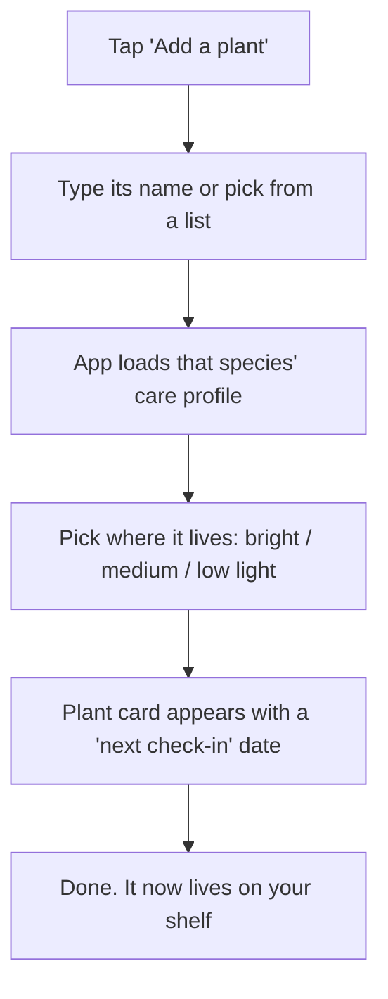
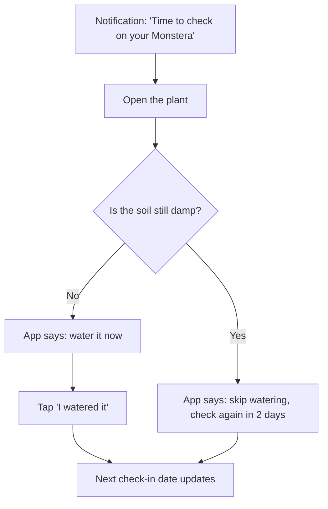
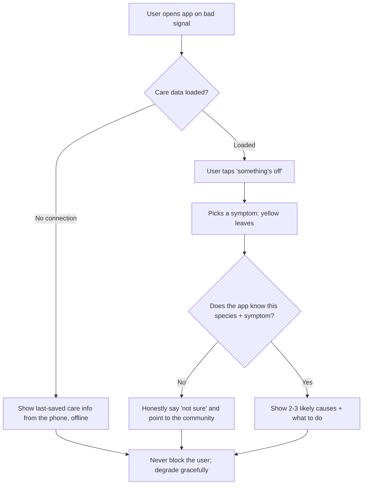
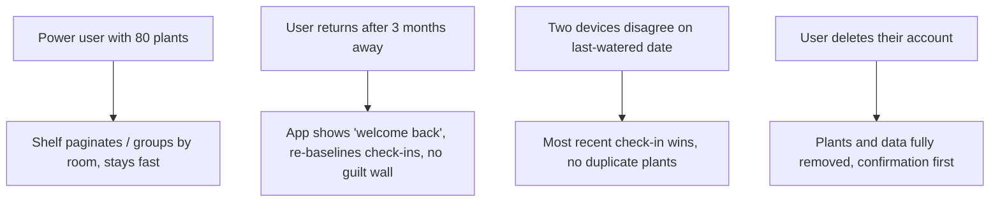
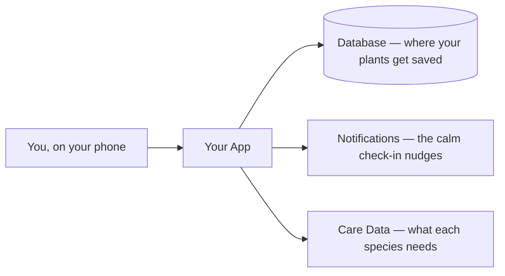
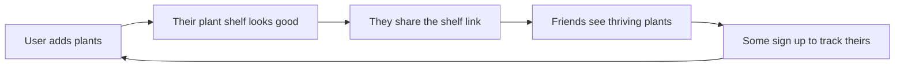

*A worked example of what vibe-check produces. The input is one sentence from a complete beginner. Below is a condensed view of the session (the thinking, every beat the skill runs) followed by the plan document it hands to your AI coding tool. A real session is a back-and-forth conversation; this is trimmed for reading, but nothing is skipped.*

---

# vibe-check — Example Output

## The starting idea

> "I want to build an app that reminds me to water my plants."

That's the whole input. Here's what the skill does with it.

---

## 0. Before anything else (the setup beats)

**Version check.** The skill announces itself as **vibe-check v1.7.2** and quietly does a best-effort fetch of the latest VERSION from GitHub. In this run the fetch came back the same version, so nothing is said. (If a newer one were out, it'd mention it once, kindly, then move on. If the fetch fails, it stays silent. It never blocks.)

**Pick the mode.** Two modes exist: Planning (default, has an idea, nothing built) and Checkup (built a while, gone messy). This person has an idea and no code, so → **Planning Mode**. (Checkup Mode would skip all of this and go straight to `references/CODE-CHECKUP.md`.)

**Read the room (the confidence dial).** One light line before teaching anything: *"Quick one so I pitch this right: have you built or coded anything before, or is this your first time?"* Answer: first time, never written a line. → **slow pace, one question at a time, every term explained.**

**Set the roles.** *"Quick framing: you're the product manager, you know what your plant people need. Your AI tool is the engineer, it writes the code. When the AI builds something technically fine but wrong for your users, you push back."*

**Show the map before the walk.** *"We'll do this in a few short steps. Figure out what you're really building, sketch how it feels, make a handful of decisions, and finish with a full plan plus a visual blueprint. I'll explain everything as we go."*

**First-timer habits, switched on for the whole session:** dumb questions invited out loud (and again later); the "why" offered as an optional one-line deeper cut, never forced; a running **Words You Now Know** glossary that grows and lands in the plan (*database, API, push notification, environment variable, SDK, deploy...*); and when intimidation spikes, name it then shrink it.

---

## 1. Phase 0 — Discovery (pressure-test the problem)

The skill doesn't start sketching screens. Discovery always runs, in two beats.

**The routing question first:** *"Before we design a single thing: have you already done real research on this, actually talked to plant owners or gathered data, or is it still mostly your own hunch?"* Answer: a hunch. Combined with "first-timer" on the dial → **full discovery, Steps 1–5.**

### Beat 1 — Grill it out of them (mandatory)

grill-me energy, aimed at the *problem and the person*, not features:

- **Who exactly?** Not "people." → someone with **8–15 houseplants who keeps killing them and feels bad about it**, not someone with one cactus.
- **The most painful moment?** → standing over a drooping plant they *just* watered, no idea if more water helps or hurts.
- **What do they do today, what have they tried?** → water on a vague schedule, panic-google when leaves yellow, sometimes give up and let it die.
- **Why hasn't an existing tool solved it?** → reminder apps just nag on a timer; plant-ID apps name the plant then go quiet.
- **Why now?** → they bought more plants in the last year and the death rate went up.
- **Who else, beyond you?** → friends who also call themselves "black thumbs."

**The future press-release power move** (used here because the grill stalled on "why now"): *"It's two years out and a big magazine ran a glowing story about your app. What's the headline?"* The freeze broke instantly: *"The app that finally let me keep a plant alive — it tells you what each plant actually needs instead of just nagging you to water."* That headline is mined like a Reddit thread: the real need isn't reminders, it's **knowing what to do.**

### Beat 2 — Reality-check by the confidence dial

Hunch + first-timer → **full discovery.** Honest framing given up front: *"Reddit gets us maybe 80% of the signal in an afternoon. It's directional, not statistical, so hold it loosely. A loud thread is a strong hypothesis, not proof."*

#### Step 1 — Map the job

*"In plain terms, what's the user really trying to get done in their life?"* → **keep their plants alive and thriving.** Broken into the steps someone takes TODAY, with no app:

1. Get a new plant (no idea what it needs)
2. Figure out how much to water it
3. Notice when something looks off (yellowing, drooping, brown tips)
4. Diagnose what's wrong
5. Decide what to do about it
6. Remember to keep checking over time

User confirmed the list. Each step is a place friction hides — and notice that "remind me" is only one slice of step 6.

#### Step 2 — Pull the pain from Reddit (the fetch ladder)

Reddit is the source. Direct page fetch is blocked, so the ladder ran in order: **(1) web search with `site:reddit.com`** on the struggle phrases — this is the rung that worked. (Rungs 2 and 3 — the `.json` / `old.reddit.com` read endpoints, then handing the user exact subreddits and phrases to paste back — were the fallbacks, not needed here.)

Struggle phrases searched: *"why is my plant dying," "tired of," "I gave up and just," "does anyone else"* across **r/houseplants** and **r/plantclinic**.

What came back, weighted by signal (upvotes, repeats):
- The loudest, most-repeated cry for help is a photo captioned **"why is my plant dying, I water it every day?"** — overwatering by well-meaning people, surfacing month after month.
- "I gave up and just buy fake ones now."
- "Reminder apps are useless, they just tell me to water on a schedule and that's how I drowned my last one."

The pain is real, badly unsolved, and it's a **knowing-what-to-do** problem, not a **remembering** problem.

#### Step 3 — Extract needs as Reduce/Increase statements

Walking every job step, kept in the user's language (a statement that names a feature isn't a need yet):

- **Reduce** the chance of killing a plant by overwatering it *(step 2)*
- **Increase** the confidence that you know what THIS specific plant needs *(steps 1–2)*
- **Reduce** the time it takes to figure out why a plant looks sick *(steps 3–4)*
- **Reduce** the effort of remembering to check on plants over time *(step 6)*
- **Increase** the ease of telling whether it's actually time to water *(step 2)*

#### Step 3.5 — Competitor gap matrix (the satisfaction-survey stand-in)

The real tools people use today, including the ugly ones. Cells are "does it well" / "does it poorly" / "doesn't do it," sourced through the same Step 2 ladder (never an invented competitor):

| Need | Generic reminder apps | Plant-ID apps | Googling it | A notebook |
|---|---|---|---|---|
| Know what THIS plant needs | doesn't do it | does it poorly | does it poorly | doesn't do it |
| Don't overwater (check soil first) | **does it poorly** (nags on a timer) | doesn't do it | does it poorly | doesn't do it |
| Diagnose why it's dying | doesn't do it | doesn't do it | does it poorly | doesn't do it |
| Get reminded to check in | **does it well** | doesn't do it | doesn't do it | does it poorly |

Read two ways: the **"get reminded" row is strong everywhere → table stakes** (you must match it, it wins you nothing). The **"know what it needs," "don't overwater," and "diagnose"** rows are weak everywhere → **gaps where you can win.** This is the matrix proof behind the reframe.

#### Step 4 — Score the opportunity gaps (ODI)

This is the skill's illustrative scoring of the evidence above — Pain read from Reddit (ODI Importance), Served read from the competitor matrix + app-store reviews (ODI Satisfaction). **Opportunity = Pain + (Pain − Served)**, never below zero, ranked, evidence-tagged. Scored for the *specific* user (8–15 plants, black thumb), not everyone:

| Need | Pain | Served | Opportunity | Evidence |
|---|---|---|---|---|
| Know what THIS plant needs | 9 | 2 | **16** | seen it |
| Diagnose why it's dying | 9 | 2 | **16** | seen it |
| Don't overwater (check soil first) | 8 | 2 | **14** | seen it |
| Remind me to water | 7 | **8** | **6** | seen it |

**This table is the whole reframe, in numbers.** *"Remind me to water"* scores **lowest (6)** — not because nobody wants it, but because every reminder app already nails it (Served 8). The original idea was aimed at the one need the market already serves. *"Know what THIS plant needs"* and *"Diagnose why it's dying"* score **highest (16)** — high Pain, almost nothing serves them. That's where you win.

**Is there money here?** Paid plant-care apps and subscriptions already exist, and plant shops spend on care content → money is moving near this pain. Green flag, not a yellow one.

**The bar is "significantly better," not "as good as."** Matching reminder apps wins nothing (the Google-clone trap). The win is the underserved gap.

#### Step 5 — Define V1 = differentiator + table stakes

- **Differentiator (build to win):** the top of the table — **species-specific care + a soil-check gate that stops you overwatering, plus symptom diagnosis.** This is the reason to exist.
- **Table stakes (build to not lose):** **calm check-in reminders** — high Pain, already well served, so people expect it. The *minimum* version that lets someone switch, not a polished clone.

**It reframes the idea, out loud.** *"You said watering reminder. But a reminder assumes the only problem is forgetting. Overwatering kills more houseplants than underwatering — so the real pain isn't 'remind me to water,' it's 'tell me what THIS plant needs so I stop killing it.' A reminder app that nags on a fixed schedule could actively make the problem worse."* The signature move: the first idea was a solution wearing a problem's clothes — and now the ODI table proves it.

**The sharpened problem:** people who want their plants to thrive but don't know what each plant needs, and accidentally kill them with guesswork (usually by overwatering).

---

## 2. Phase 1 — The Dream

- **The idea, in their words; reframed back sharper and confirmed:** "a thriving-plants coach, not a watering alarm." Got a yes.
- **What's frustrating today (no app):** watering by guess, panic-googling, losing plants and not knowing why.
- **The worst-moment scene** (made concrete, not abstract): *"It's the moment I notice a leaf going yellow on the plant I've been most careful with. I'm standing in my living room, I just watered it two days ago, and I have no idea if it needs more water or less. I feel like I'm failing it, and I end up watering it again — which is probably exactly the wrong thing."* That scene is where demand lives (Bob Moesta's demand-side lens): the struggling moment creates the demand, and the messy "just water it again" workaround feels completely rational in that moment.
- **The ONE thing it should do perfectly:** tell me whether this specific plant needs water *right now*, and why.
- **What worry disappears when it hums:** the low-grade guilt of slowly killing things you care about.
- **Who else wants it:** the friends who also call themselves black thumbs.

**Lock in the three lines** (filled in WITH the user, confirmed):

1. **What you're accomplishing:** keep your plants alive and know *why* they're thriving.
2. **What you do instead today:** water on a vague guess, panic-google yellowing leaves, lose plants.
3. **Why that sucks:** the guessing is what kills the plant, and you only find out too late.

Said back: *"The real goal is keeping your plants alive and knowing why. Right now you guess and google, which sucks because the guessing is the thing killing them. The app lets you check what THIS plant needs instead of watering on a hunch. The people are you and your black-thumb friends."* The outcome is kept singular and checkable: *"I'd know this worked if I stopped losing plants to overwatering."*

---

## 3. Phase 2 — The Experience

### Crazy 3s (three real directions, each pushed to feel real)

Three genuinely different directions for the core experience — not three flavors of one — each pushed far enough, with real-ish content, to *feel* real side by side on a comparison board (`HTML-BLUEPRINT.md`), not bare boxes:

- **A — The Calendar.** A watering schedule with reminders. (The original idea. On its own it risks telling people to overwater.) Pushed far enough to show a real week of "water Monstera today" rows — and seeing it made the overwatering risk obvious.
- **B — The Plant Profile.** Each plant gets a page: what it is, what it needs, how it's doing. Care advice, not just alarms. Rendered with a real Monstera card reading "likes to dry out between waterings."
- **C — The Check-In.** The app asks *you* questions ("droopy? yellow leaves? soil still damp?") and tells you what to do, instead of assuming. Rendered as a real two-question flow ending in "skip watering, check again in 2 days."

**Share and vote.** Walked through all three; user cherry-picked the bits that landed. The moment B + a slice of C clearly won, the skill stopped building the others and poured into the winner.

**Chosen combination** (simpler than any single sketch): **B as the backbone** (a real profile per plant with species-specific care), borrowing **C's "check the soil before you water" gate** so it never blindly tells someone to water on a timer. A's reminders stay, but framed as *"time to check on your Monstera,"* not "water now."

### The five-lens gut-check (incl. Ethical)

- **Desirable:** Yes — plant owners actively ask for this in their own communities (discovery evidence).
- **Usable:** Yes — the least techy plant lover can add a plant by name and read "your snake plant likes to dry out, you're probably watering too often." (The Grandma Test, below.)
- **Feasible:** Yes — an AI tool can build this. Species care data starts as a small built-in list and grows.
- **Viable:** Cheap — fits comfortably on free tiers to start. (Phase 6 prices it.)
- **Ethical:** ⚠️ One thing to design out. The tempting move is anxiety-driven notifications (*"Your plant is DYING 😢 you haven't watered in 5 days!!"*) because guilt drives app opens. That's a dark pattern — it makes money (engagement) when the user feels bad, not when the plant thrives. **Decision:** notifications stay calm and helpful (*"Time to check on your Monstera"*), no fake urgency, no guilt. The deeper test passes too: the app earns its keep when the plant *lives*, so it profits when the user wins. If a plant shop ever gets added, no manufactured "buy now or it dies" pressure.

Passes. The ethical catch became an actual design rule, not a lecture. (Had it failed at the *core* idea, the skill would rethink the concept, not patch the symptom.)

### The second look (the craft pass)

One deliberate pass before locking the winner, out loud with the user: *what here is generic, the same thing every plant app does? What gives it a point of view? What to cut?* The generic part: a plant grid with status dots looks like every plant app. The point of view: lead with the **soil-check gate and "you're probably overwatering"** honesty — most apps flatter you, this one gently corrects you. Cut: the species-encyclopedia browsing (V2). One pass, not a perfection hunt. Then locked.

### Map the chosen direction, screen by screen

- **First thing someone sees:** their shelf of plant cards (or an empty "add your first plant" if brand new).
- **Right after signup:** add one plant by name → instantly see its care profile. That's the first thing they do.
- **The MAIN thing, step by step:** "I tap a plant, I see 'is the soil still damp?', I answer, the app tells me to water or wait, I tap 'I watered it,' the next check-in updates."
- **Empty states:** no plants yet → a friendly "add your first plant"; nothing due → "all your plants are happy today."
- **Notifications/reminders:** calm check-in nudges, never guilt.
- **Users interacting with other users:** not in V1 (community Q&A is V2).

### The aha moment, designed backward (first 30 seconds)

- **The single moment they first feel the value:** the instant they add a plant by name and the app says, in plain words, *"your snake plant likes to dry out — you're probably watering too often."* The "oh, this is for me."
- **How fast after signup:** aim for the first 30 seconds.
- **Designed backward from it:** no long signup form (ask for an account later), **no intro carousel**, drop them straight into "add a plant." Progressive disclosure + a small satisfying success hit the moment the care profile appears. Two aha moments stacked: (1) it *knows* my plant, (2) it tells me I've been overwatering — proof it's special. The first 30 seconds feel magical, not like homework.

### The Grandma Test

*"Who's the least techy person who'd ever use this? Could THEY add a plant and read the advice with nobody helping?"* Yes — typing a plant name and reading one plain sentence clears the bar. Nothing to simplify before adding features.

### The stress test

*"Picture the user at their most stressed — low battery, bad signal, just got home late, plant looks awful."* Walking it surfaced the failure modes: care data must work **offline** (bad signal in a back room), the soil-check must be answerable in **two taps**, and the diagnosis must **gracefully admit when it doesn't know** instead of guessing and making it worse. These feed the Rough Day flow.

### Three user-flow diagrams

**1. Happy Flow — adding a plant:**



**Happy Flow — the daily check-in (the core loop):**



**2. Rough Day Flow — things go wrong (built from the stress test):**



**3. Edge Cases — weird but real:**



### User story mapping (journey → features)

Walking the happy flow one step at a time, asking *"what has to be true for the user to get through this step?"* — each answer is a feature that falls out of the journey (Jeff Patton):

- *Add a plant by name* → needs a **species lookup + a built-in care dataset.**
- *See what it needs* → needs a **species care profile** (water guideline, light, common deaths).
- *Decide whether to water* → needs the **soil-check gate** logic.
- *Get nudged over time* → needs **scheduled check-in notifications.**
- *Handle a sick plant* → needs the **symptom helper** with an honest "I don't know" path.
- *Show off the shelf* → needs the **shareable shelf page** (this is also the growth loop).

That feature list is carried straight into Phase 8 as the spine of V1.

---

## 4. Phases 3–7 — Connections, decisions, blueprint, reality, unknowns

### Phase 3 — The Connections

- **Where the data lives:** mostly in-app; the species care data is a **built-in dataset** (no external source needed for V1).
- **Pull automatically vs. type in:** user types the plant name; the app fills the care profile.
- **Send messages?** Yes — **push notifications** for calm check-ins. (Push notification: the little nudge that pops up on your phone.)
- **Smart/AI features?** A light touch later for symptom diagnosis; V1 uses simple species rules.
- **Handle money?** Not in V1.

**Integration rule:** any service uses the company's **official SDK**, never a third-party wrapper (so when something breaks, you're talking to the real thing, not a middleman). Noted in the plan.

### Phase 4 — The Decisions (framed as product choices)

Each gives a recommended pick, the why in a sentence, one alternative, and the cost:

- **Who can use it? → accounts (auth).** Pick: Supabase email login. Why: simplest managed login for a beginner. Alt: device-only/no-login if you skip sync. Cost: free tier.
- **Where does data get saved? → database.** Pick: Supabase (Postgres). Why: generous free tier, backups handled for you. Alt: on-device SQLite. Cost: free to start.
- **How does it make money? → payments.** Pick: none in V1. Why: prove people keep plants alive first. Alt: a later one-time "pro plant pack." Cost: n/a.
- **Phone / computer / both? → platform.** Pick: Expo (React Native), one codebase for iPhone + Android. Why: ship to both stores without learning two languages. Alt: a mobile web app (PWA). Cost: free.
- **Works without internet? → offline.** Pick: cache the care data on-device. Why: the stress test showed back-room bad signal. Alt: online-only. Cost: free.
- **How does it get online? → hosting/deployment.** Pick: Expo's build + the app stores. Why: the standard beginner path. Alt: TestFlight-only for friends. Cost: Apple Developer $99/yr at publish.

**Payments risk raised now** (even though V1 has none): *if you ever add payments, apply to the provider EARLY before writing payment code (they reject without telling you why, usually after you've built the flow); keep a backup like a Shopify buy button; and you'll need a Privacy Policy, Terms of Service, and Refund Policy live first — EU users get a 14-day cooling-off period. AI can draft them, you must read them.*

### Phase 5 — The Blueprint

System diagram with beginner labels (data moving in the direction it travels):



**Build it so it stays navigable** (per `KEEPING-CODE-NAVIGABLE.md`, in plain words): *"We'll build the care engine, the reminders, and the shelf as separate self-contained pieces, each in its own folder, so your AI can work on one without poking the others."* A well-organized app is one the AI keeps building cleanly; a messy one is where it starts breaking things.

**Code-ownership principle:** *"Your code lives on GitHub. You own it. Outgrow Expo or want to switch tools? You take your code and walk. Never build somewhere you can't export your code from."* (Walk through `GITHUB-AND-DEPLOYMENT.md` when it's time to set up GitHub.)

### Phase 6 — The Reality Check

- **Complexity score:** **about a 4 out of 10.** A to-do list is a 2, Instagram's a 9. There's a database, push notifications, and a care dataset, but no payments and no real-time multiplayer — very doable for a first build with AI help.
- **Cost estimate:** see the table in the plan below.
- **Architecture cost warning:** *those are the sticker prices. HOW the app uses them matters just as much. Checking the database every 30 seconds for due reminders could run hundreds a month at scale; scheduling the notification once and letting the phone fire it is basically free. The plan steers around traps like that.*
- **Timeline:** **V1 core ~2–3 weeks with AI help; V2 (photo ID, light meter, community) another 2–3.**
- **What to build first:** the smallest genuinely-useful version — add a plant, see its care profile, the soil-check gate. Everything else is the V2 pile.
- **Learning project or real users?** → real users (the black-thumb friends), so quality, accessibility, and the privacy policy get real attention.

**The framing check (Teresa Torres):**
- *Solution-first?* It started solution-first ("a reminder app") — and discovery already walked it back to the real problem (overwatering from not knowing). Named and corrected.
- *Outcome mismatch?* The soil-check gate directly moves the Phase 1 goal (fewer plants lost to overwatering). No mismatch.
- *Mostly guesses?* No — the top needs are tagged **seen it**, not hunch/guess.
- *A solution dressed as a need?* "Remind me to water" was exactly that; dug under it to the overwatering pain. Handled.

**The riskiest-assumption test:** the single belief that, if wrong, sinks it → *"people will trust an app's soil-check over their own watering habit enough to change behavior."* Cheapest check BEFORE building: post the core idea in r/houseplants and DM ten people who wrote "why is my plant dying" — ask if they'd use a tool that tells them *not* to water yet. If the test takes two weeks to set up it's a project, not a test. Build the real thing only after that bet survives a cheap check.

### Phase 7 — The Stuff They Don't Know About

Each tagged handle-now / before-launch / later:
- **Security:** passwords scrambled, no secret keys in the code — they live in a protected `.env` file (environment variables). *(Now.)*
- **Privacy & legal:** accounts mean a basic privacy policy. *(Before launch.)*
- **Accessibility:** readable text sizes; never rely on color alone (a yellow-leaf warning needs words too). *(Now.)*
- **When it breaks at 3am:** error tracking/monitoring so you find out before users do. *(At launch.)*
- **Backups:** Supabase does these automatically. *(Now — already covered.)*
- **Updates & maintenance:** an app is never "done." *(Later, but coming.)*

---

# The Plan

*(This is the document you hand to your AI coding tool. The more specific it is, the better the AI builds it the first time. Framing for the human: this plan isn't for you, it's the instruction manual for your AI — specificity in, specificity out. Not "a watering screen," but "the user needs to feel sure whether THIS plant needs water right now, and a dead-easy way to log that they watered it." And the plan has checkpoints baked in, so the AI stops at each phase to explain what it built, why, and what's next — so you never get lost.)*

## 1. The Problem

"My plants keep dying and I don't know why. I water them and they still droop, or the leaves go yellow. I feel like I'm doing something wrong but I can't tell what." Overwatering from well-meaning guesswork is the silent killer.

## 2. The Vision

You open the app and see your plants as little cards, each showing how it's doing. Tap one and it tells you, in plain words, what this specific plant needs and whether it's time to actually check on it. When something looks off, the app helps you diagnose it instead of just sounding an alarm.

## 3. The Goal (the three lines)

- **What you're accomplishing:** keeping your plants alive and knowing why they're thriving.
- **What you do today instead:** water on a vague guess, google panic-search when leaves yellow, lose plants.
- **Why that sucks:** the guessing is what kills the plant, and you only find out when it's too late.

## 4. Who It's For

Houseplant owners with roughly 5–20 plants who care but feel like they have a "black thumb." Realistically your first 10 users are people in one plant community you're already part of.

## 5. User Flows

The three mermaid diagrams above: the **Happy Flow** (add a plant; the daily soil-check loop), the **Rough Day Flow** (bad signal, unknown symptom — degrade gracefully, never block), and the **Edge Cases** (80 plants, a 3-month return, two devices disagreeing, account deletion).

## 6. Features

**V1 (build now):**

- Add a plant, with a species care profile
- A plant card showing status and next check-in
- The "check the soil first" watering gate *(the differentiator)*
- Calm reminders to check in *(the table stake)*
- Symptom helper for the common problems *(the differentiator)*
- A shareable "my plant shelf" page (this is the growth-loop feature, see §15)

**V2+ (later):**

- Identify a plant from a photo
- Light meter using the phone sensor
- Community Q&A in-app
- A shop (only if it can be done without panic-selling)

## 7. System Architecture


## 8. Tech Stack

| Tool | What it does | Why it's here | Cost |
|---|---|---|---|
| Expo (React Native) | Builds the phone app for iPhone + Android from one codebase | A beginner ships to both stores without learning two languages | Free |
| Supabase | The database + login | Generous free tier, easiest managed database for beginners, does backups for you | Free to start |
| Expo Notifications | Sends the check-in reminders | Built into Expo, no extra service | Free |
| Built-in care dataset | Species watering/light guidance | Start with ~50 common houseplants in a simple file, no paid API needed | Free |

## 9. Data Model (in plain words)

- A **plant** has a nickname, a species, a spot (bright/medium/low light), a last-checked date, a last-watered date, and belongs to a user.
- A **species profile** has a name, a rough watering guideline, light needs, and the 2–3 common ways it dies (with fixes).
- A **check-in** records when a plant was checked, whether it got watered, and a note.
- A **user** has an account and notification preferences.

## 10. House Rules for Your AI

Plain-language rules so the AI builds the same way twice and the codebase stays navigable. You don't need to understand these yourself. Ready to paste into your project guide (CLAUDE.md):

```markdown
# House Rules for PlantCoach

You're the engineer. I'm the product manager. Follow these on every change.

## How to work
- Think first: before non-trivial code, say what you'll build and ask about anything unclear. Don't guess.
- Keep it simple: build the simplest thing that solves the problem. No extra features, no "just in case" code.
- Change only what I asked: don't rewrite or "improve" unrelated code. If you spot something, tell me, don't do it.
- Aim at a finish line: work to a clear, checkable "done," then show me how each item checks out.

## How to write code
- Don't repeat yourself: one home for the care logic, one home for reminders.
- Same name everywhere: if it's a "check-in," it's always a "check-in."
- Handle the sad path: every failure shows a friendly message and a way out (offline, unknown species, no signal).
- Leave a trail: log important actions (what happened, worked or failed, any error).
- Keep layers apart: screens, logic, and data storage stay separate.
- Self-contained features: care engine, reminders, and shelf each in their own folder.

## Definition of done (every change clears all of these)
- It works and didn't break anything that worked before.
- Build, linter, and formatter are green.
- Any test fails on the old code and passes on the new (fail-first).
- It touched only what the task needed.
- It matches the project's names and patterns.

Working is the floor, not the bar.
```

## 11. Integrations

- **Expo Notifications** for push reminders — Expo's official module, not a third-party wrapper.
- **Supabase** for database + auth — the official Supabase SDK, not a framework's "convenient" abstraction.

The rule: always talk to the real thing, never a middleman. Noted so that when something breaks, the first question is "am I talking to the real SDK?"

## 12. Cost Breakdown

Roughly **$0/month** to start. Everything above has a free tier that comfortably covers your first hundreds of users. The first real cost is the Apple Developer account ($99/year) only when you publish to the App Store.

**Architecture cost warning:** don't poll the database on a timer for "due" reminders — schedule each notification once and let the phone fire it. Polling every 30 seconds can quietly cost hundreds a month at scale; the event-driven way is basically free.

## 13. Timeline

- **V1 core (~2–3 weeks with AI help):** setup, data model, login, the add-a-plant + soil-check core, reminders, the shelf, the symptom helper.
- **V2 (~another 2–3 weeks):** photo ID, light meter, in-app community.

Honest and phased. Build the smallest useful version first; the rest waits.

## 14. Distribution (start before launch, not after)

Your first 10 users are in **one plant community you already belong to** (a local plant-swap group, r/houseplants, a Discord) — the same place you mined for pain in discovery. The first concrete move: don't drop a launch link. Show up for two weeks answering "why is my plant dying" posts with genuinely good help, then mention you're building a thing for exactly this. That community IS your launch. (If you can't name where the first ten come from, that's the riskiest part of the whole thing, not a feature.)

## 15. Growth Loop

A modest **content loop**: every user gets a public, link-shareable "my plant shelf" page. Plant people love showing off their plants, so some will share it, and a few who see it sign up to track their own. The loop is tied to the aha moment — the shelf looks good *because* the app keeps the plants alive.



- **Enabling feature (on the V1 list):** the shareable shelf page.
- **The one number to watch:** shares per active user per month (cheap to collect via a `?ref=` link on each shelf). If almost nobody shares, the loop isn't real, and that's fine — your r/houseplants presence is the growth engine instead.

## 16. Things to Handle Before Launch

- **Security:** passwords scrambled, no secret keys sitting in the code (they go in a protected `.env` file). *(Handle now.)*
- **Privacy/legal:** accounts mean a basic privacy policy. *(Before launch.)*
- **Accessibility:** readable text sizes, the app works without relying only on color (yellow-leaf warnings need words too). *(Handle now.)*
- **Monitoring:** error tracking so you find out before your users do. *(At launch.)*
- **Backups:** Supabase handles these automatically. *(Already covered.)*

## 17. Pre-Launch Audits

Run these three prompts before you show the app to a single soul:

- **Security audit:** "Audit my codebase for security vulnerabilities. Check authentication, authorization, input validation, rate limiting, secrets management, file upload security, CORS/CSRF protections, and timing attacks. Give me a severity rating for each issue found."
- **Scalability audit:** "Audit my codebase for scalability issues. Check for N+1 queries, unbounded database reads, missing pagination, polling vs real-time listeners, caching gaps, cold start performance, and concurrent user handling. Estimate the monthly cost impact of each issue."
- **Production readiness audit:** "Audit my codebase for production readiness. Check for error monitoring, test coverage on payment and authentication paths, accessibility basics, and deployment configuration. Tell me what will fail silently in production."

## 18. Working With Your AI Tool

- Keep your project guide (CLAUDE.md) **under 100 lines**; split details into smaller files in the folders they belong to.
- Set up **debug logging early**, before bugs show up. Ask your AI once: *"Define a simple, consistent debug-logging plan for this app — what to log, the levels (INFO up to ERROR), short category names per feature. Write it to `docs/DEBUG-LOGGING.md` and follow it everywhere."* Then point CLAUDE.md at that file.
- **Turn off AI-tool plugins** you aren't using; they eat the AI's working memory.
- Treat **every prompt like a tiny spec.** Not "add reminders." Instead: "Add a daily check-in notification per plant. It says 'Time to check on your [plant].' Tapping it opens that plant's soil-check. No notification if the plant was checked today."
- Before applying a fix, ask: *"How does this change what my user sees? Will it make the app slower? What does this look like on their worst day?"*
- Manage *how* the AI works: the four ground rules (think before coding, keep it simple, change only what was asked, aim at a finish line) plus the improvement loop (finish line → snapshot → one small change → make it *show* the check → keep or undo) and the definition of done. Working is the floor, not the bar. (Full version in `MANAGING-YOUR-AI.md`; a short version lives in CLAUDE.md.)

## 19. Build Phases with Checkpoints

1. Project setup and folders
2. Database + the data model (plants, species profiles)
3. Login (sign up, log in, log out)
4. **Core:** add a plant, see its care profile, the "check soil first" watering gate
5. Reminders (push notifications)
6. The shareable plant shelf
7. Symptom helper
8. Polish + error handling + accessibility
9. Pre-launch (privacy policy, security pass, monitoring)
10. Deploy to the stores

GitHub and going-live are taught at the right moments, not all at once: *local* when files first appear (Phase 1), *Git/commit/push/GitHub + make an account* after Phase 4 works ("let's make sure you can never lose this"), the *secret keys / `.env`* rule the moment an API key appears, and *production/deploying* at Phase 10 — always tied to the two fears: never lose your work, always get back to a working version.

Each phase ends with a checkpoint where your AI stops, explains what it built in plain words, and waits for you. Here's the one after Phase 4, as a sample of the exact format:

```
═══════════════════════════════════════════════════════════
🔖 CHECKPOINT: The Core Feature
═══════════════════════════════════════════════════════════
📍 WHERE WE ARE
"We just finished the heart of your app. You can now add a plant,
see what it needs, and the app checks whether the soil is dry
before it ever tells you to water."
🔧 WHAT WE JUST BUILT
- A screen to add a plant and load its care profile.
- The 'check the soil first' gate, so the app never blindly tells
  you to water on a timer.
💡 WHY WE BUILT IT THIS WAY
"Remember how we realized overwatering is what actually kills most
plants? That's why the app asks 'is the soil still damp?' before it
ever says 'water now.' The whole reason your app exists is to stop
the guessing that kills plants, so that check had to come first."
📋 WHAT'S NEXT
"Next we'll add the calm reminders, the nudges to check on a plant
without guilt-tripping you."
❓ QUESTIONS?
"Does this make sense? Want to see it working on your phone before
we move on?"
Wait for the user before continuing.
═══════════════════════════════════════════════════════════
```

## 20. Open Questions

- Start with a built-in list of ~50 plants, or let users add custom species from day one?
- Do reminders feel better as a fixed gentle schedule, or fully driven by the soil check-in?

---

## The two deliverables

This plan is one of two things vibe-check produces. The markdown above is the precise instruction manual you hand to your AI coding tool. Alongside it, the skill also generates a **visual HTML blueprint** — a warm, friendly web page you open in your browser to actually *see* your app and believe you can build it: the flow diagrams, the architecture, the cost table, and the build phases laid out as a journey you can picture finishing. → **[plant-blueprint.html](https://texasbedouin.github.io/vibe-check/examples/plant-blueprint.html)**

The markdown is the plan you hand off; the HTML is what makes you believe you can; the checkpoints are what keep you from getting lost along the way.

---

*Generated by [vibe-check](https://github.com/TexasBedouin/vibe-check). It turns a beginner's one-line idea into a plan their AI coding tool can actually build, and refuses to skip the part where you figure out if you're building the right thing.*

*Reflects vibe-check v1.7.2.*
